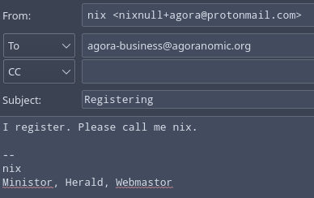

## Step 1: Subscribe to the lists.

Self-explanatory. Subscribe to all the lists on the main page. Make sure to confirm too.

## Step 2: Filter messages.

Filter agora messages to their own folder. [On gmail](https://support.google.com/mail/answer/6579?hl=en#zippy=%2Ccreate-a-filter) a filter to catch everything would look like this:

    list:(agora-business.agoranomic.org) OR list:(agora-discussion.agoranomic.org) OR list:(agora-official.agoranomic.org) OR list(agora@listserver.tue.nl) OR list(agora@groups.io)
    
All popular email providers and clients should provide some way to filter, just look it up.

## Step 3: Register

Send a message to agora-business@agoranomic.org simply stating you intend to register. Something similar to below will work:

## Optional: Join the Discord or IRC

Most players can be found at [the Agora discord](https://discord.gg/JCC6YGc) or [the Agora irc](irc://irc.libera.chat:6667/##nomic). They are bridged, meaning you only need to join one of them and can communicate in both, but the Discord has some additional channels and features. Joining either is entirely optional, but helpful for connecting to the community.
