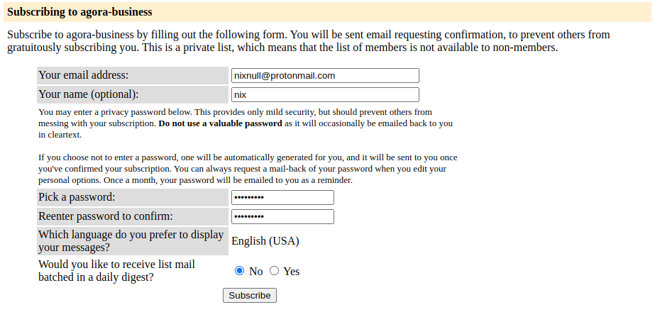
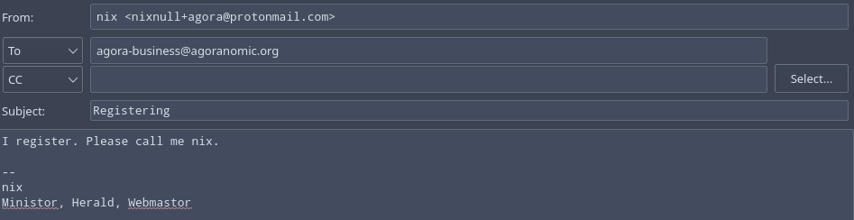

# Subscribing

Subscribing for the three main lists looks the same. FIll out your email address, and optionally a name and password (for accessing the private archives, if you want). **Don't use digest to play, it's difficult to follow along or reply to properly.**

Subscription to the backup lists is slightly different. Subscription to gio requires another player to manually approve it, which should happen shortly.

# Registering

Registering simply requires saying you do, like so:

# Voting

Coming soon.

# Proposing

Coming soon.

# Other Actions

Coming soon.
